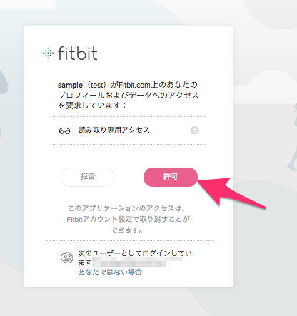
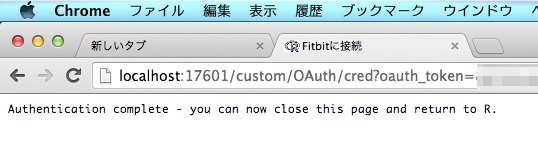

#READ ME
- R Script get data From Fitbit
- Authentication is required　to use the Fitbit API
	- I used {httr} instead {ROAuth}
- after [token <- oauth1.0_token(fitbit,fbr)],It is necessary to authenticate　in browser　like this： 
	- 
- If you have successfully authenticated, then it is displayed as follows:
	- 
	
#preparation
- it is necessary to set the **Browser**　type your fitbit API setting (Application Type)  

